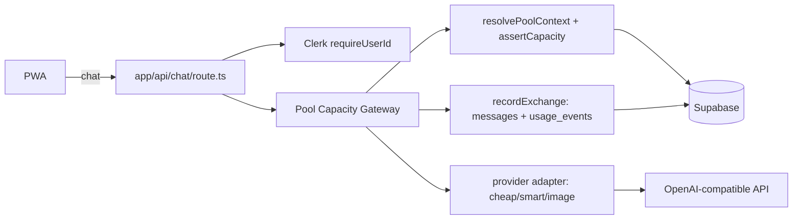

# Pool — closed alpha runbook

Pool is a Next.js PWA where friend groups split AI access through one shared
monthly capacity budget. Every request flows through the **Pool Capacity
Gateway** ([lib/server/pool-gateway.ts](lib/server/pool-gateway.ts)), which
resolves the caller's pool, enforces budget + fair-use limits, routes to the
configured provider tier, and records usage for the ledger.

## Modes

The app runs in one of two modes, controlled by `NEXT_PUBLIC_POOL_DEMO_MODE`:

| Mode | Env value | What works |
| --- | --- | --- |
| **Demo** | `true` (default) | Full UI with localStorage persistence, canned replies, zero keys needed |
| **Live** | `false` | Clerk auth, Supabase persistence, real provider calls, budget enforcement |

## Setup (live mode)

1. **Clerk** — create an app at clerk.com, grab the publishable + secret keys.
   Also create a JWT template named `supabase` (default claims are fine) so the
   client can mint Supabase-scoped tokens if needed later.

2. **Supabase** — create a project, then run [supabase/schema.sql](supabase/schema.sql)
   in the SQL editor. It creates all tables, indexes, and RLS policies.

3. **Providers** — set `OPENAI_API_KEY` and/or `XAI_API_KEY`. The gateway
   routes each tier to the cheapest capable provider: with both keys set,
   `cheap` → OpenAI `gpt-4o-mini`, `smart` → xAI `grok-4.3` (~4x cheaper
   output than `gpt-4o`), `image` → OpenAI `gpt-image-1`. With one key, all
   text tiers fall back to that provider. Override per tier with
   `POOL_PROVIDER_*` / `POOL_MODEL_*`.

4. **Env** — copy `.env.example` to `.env.local`, fill values, and set
   `NEXT_PUBLIC_POOL_DEMO_MODE=false`.

```bash
npm install
npm run dev
```

## Flows to verify after setup

- Sign up → redirected into onboarding → create a pool → land in chat
- Send a message on each tier (cheap / smart / image)
- Misc → POOL CAPACITY strip ticks up; ledger shows your requests
- Share an answer → it appears in the squad stream and at `/m/[id]`
- Copy the invite link (`/join/[code]`) in a second account → joins the pool
- Owner controls: regenerate invite, reset monthly budget

## Budgets and fair use

- `POOL_MONTHLY_BUDGET_CENTS` sets the shared pool budget (default $30/mo).
- The hard stop only fires when the **pool** budget is exhausted.
- The per-member cap is soft: past `POOL_MEMBER_SOFT_SHARE` (default 35%) of
  pool usage, the member gets a whale warning in chat and on the ledger, but
  is never blocked.

## Key rotation

- Provider keys: replace `OPENAI_API_KEY` / `XAI_API_KEY` in your env /
  hosting dashboard and redeploy. Keys are only ever read server-side in
  `lib/server/providers.ts`.
- Service role key: `SUPABASE_SERVICE_ROLE_KEY` is server-only, used by the
  gateway for metering writes that bypass RLS. Never expose it to the client.

## Monthly reset

Usage is bucketed by calendar month (`usage_events.created_at`), so budgets
reset automatically on the 1st. The owner's "reset monthly budget" control is
for mid-month top-ups or tier changes — it updates `monthly_budget_cents` and
clears an `exhausted` status.

## Architecture


